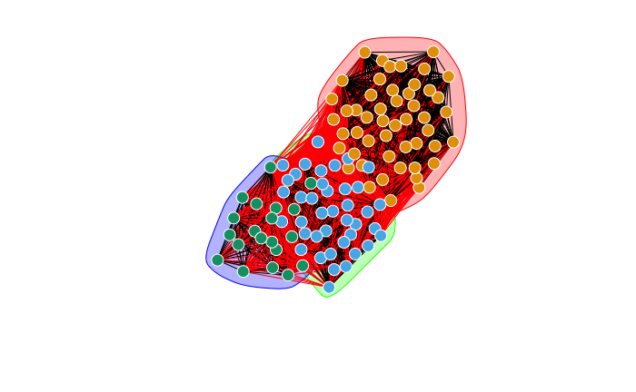

# Interactions, information and emergence: Exploring task allocation in ant colonies using network analysis #
**Team members:** Anshuman Swain1,* , Sara Williams2,* , Louisa Jane Di Felice3,* , and Elizabeth A. Hobson4

1Department of Biology, University of Maryland, College Park, MD 20742, USA;
2Department of Marine and Environmental Sciences, Northeastern University, Boston, MA, USA;
3Institute of Environmental Science and Technology, Autonomous University of Barcelona;
4Department of Biological Sciences, University of Cincinnati, OH, USA;
*contributed equally

**Keywords:** Ant behavior, insect social networks, task allocation, emergent behavior, effective information

## Brief introduction to the project ##
Colony behaviour in ants is affected by how they interact with each other. Through these interactions, ants barter information that impact the allocation of tasks or functions among them. What is the specific role played by interaction networks in determining task allocation, and how this relates to the exchange of information flows between individual ants and between functional groups of ants - is relatively under-explored. 
In this project, we use robust network-based methods and metrics to a publicly available dataset of interaction networks (see Mersch et al., 2013, Science) in six Camponotus fellah colonies, where ants are nodes and their interactions are edges. We calculate network centrality metrics and certain entropy measures, and compute a switching interaction matrix, to explore how interaction patterns impact the switching behavior across three functional groups: foragers, cleaners and nurses. 

**Figure 1**: An example of ant interaction network visualized along with the communities detected via the Louvain algorithm. Please note that the network is weighted, but for simplicity of illustration, we have replaced the weighted edges with simple ones. Here node color represents community identity; red interactions represent interactions between nodes of different communities and black ones show the ones within a community.

## Short Description of the files in this repository ##

***Base scripts***
These scripts are written in R and have three files in the folder 'base_scripts':
1. An R script for cleaning original dataset and building networks
2. An R script for calculating network metrics (Strength, Betweenness Centrality, and   Bridge Betweenness)
3. An R script for making null networks for statistical analyses

***Information theory based methods and their scripts***
This set of R scripts descripe the pipeline for calculating the entropy measures used in our work, and include:
1. An R script to calculate 'Causal emergence', which can measure hierarchy in information flow in networks
2. An R script to check network information 
3. An R script to calculate 'Effective information', which descrbes the noisiness of the network
There are three other scripts in this folder, which serve as side-utilities.

This page will be updated with more information, once we publish the work. If you have any questions, please feel free to reach out to us.
